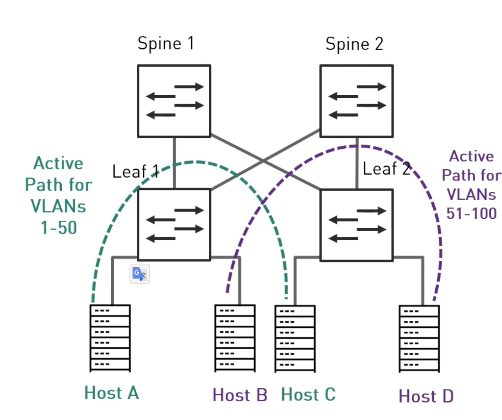
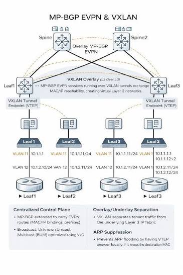
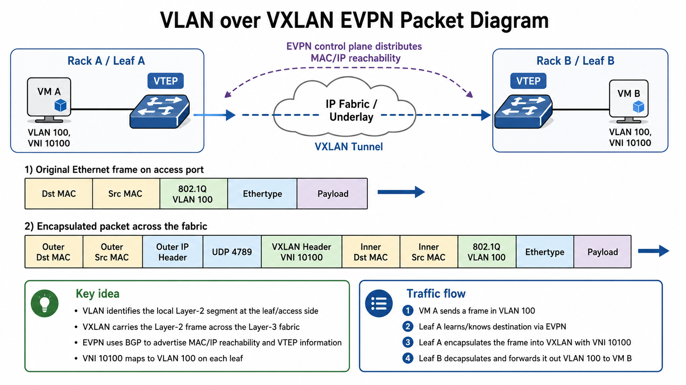
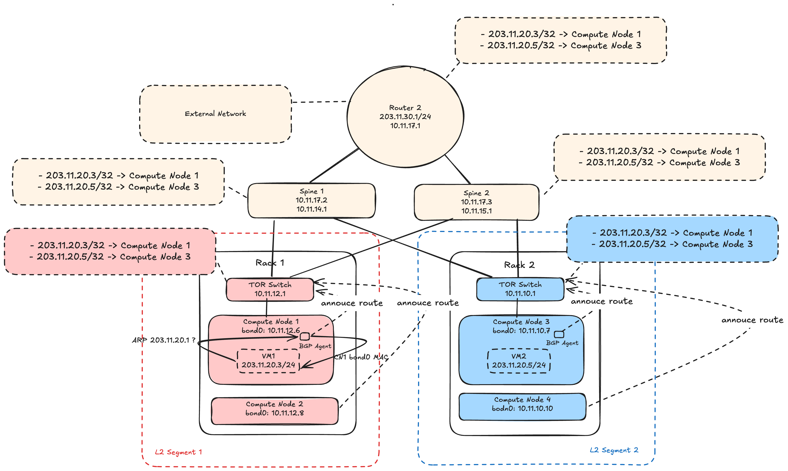

## Network Desgin For Cloud Data Center 

### Design Solution 1 - Layer 2 only design



In this design, bot Leaf and Spine Switches are both used for L2 packet forwarding between Compute Hosts in different racks

L2 only primarily leverages VLANs for segregating its connectivity and relies on legacy features like MLAG and spanning tree protocol (STP) to provide a distributed solution. The L2-only solution still has a place in network environments, typically in simple, static environments that don’t require scale. 

People are comfortable with L2, as it uses tried-and-true technologies familiar to most people. It’s simple in the protocol stack, making all forwarding decisions based on only the first two layers of the OSI model. Also, most low-cost network devices on the market are capable of these feature sets.

However, L2 has gaps in scale and performance. Relying on STP across three tiers to prevent loops, leads to inefficient redundant paths. To circumvent this limitation in spanning-tree convergence, you can try deploying back-to-back MLAG. MLAG is not as efficient as a pure layer 3 solution at handling device failures and synchronizing control planes, however. L2 networks tend to limit broadcast and multicast traffic. These are just a few limitations that create a hidden cost of ownership around deploying an L2 only design.

#### L2 Storm problems

There’s storm control, and you can deploy it on every link in your network, but the single circulating broadcast packet (and its infinite copies) will trigger storm control on all switches, and prevent other valid broadcasts (for example, ARP requests) from being propagated, effectively causing a DoS attack on the whole layer-2 domain. Furthermore, the never-ending copies of the same broadcast packets delivered to the CPU of every single switch in the layer-2 domain will eventually start interfering with the control-plane protocols, causing further problems.

The obvious conclusion: transparently bridged network (aka layer-2 network or VLAN) is a single failure domain.

For examples:

- Trouble shooting malformed packets: https://www.reddit.com/r/networking/comments/2yd6tu/a_malformed_packet_storm_6000_miles_away_a/
- December 27, 2018 CenturyLink Network Outage Report: https://docs.fcc.gov/public/attachments/DOC-359134A1.pdf
- Real-Life Data Center Meltdown: https://blog.ipspace.net/2019/05/real-life-data-center-meltdown/

This means that when one port in your L2 network is compromised, it can flood the entire L2 segment with invalid broadcast packets (for example, ARP requests). 

In this case, storm control on all switches will be triggered and will prevent both malformed ARP packets from the failed port and valid ARP packets from healthy ports. This leads to valid connections being blocked because the source and destination ports cannot resolve MAC-IP bindings, resulting in a scenario known as an L2 DDoS attack.

### Design Solution 2 - EVPN-VXLAN Tunneling


In this design, bot Leaf or Top-Of-Rack Switches are used for forwarding L2 packets for Hosts in the same Rack. Between Racks, L2 packet is encapsulated in to a VXLAN packet, then transmiting between Spine switches and other ToR switches by L3 IP Network by VXLAN-EVPN technology





This architecture provides the greatest flexibility, with all the benefits of a pure layer 3 solution, and provides the network administrator the adaptability to support applications requiring L2 to function. 

It provides the benefits of L2 adjacency without introducing inefficient protocols such as STP and MLAG. Leveraging EVPN as the L2 control plane and multihoming as the optimal alternative to MLAG, overlay solutions solve many inefficiencies with L2.

A one-size-fits-all solution like VXLAN and EVPN could be thought of as ideal, but even this has drawbacks. Its detractors point to the multiple layered protocols required to make it operate. The solution builds on a BGP-enabled underlay with EVPN configured between the tunnel endpoints. VXLAN tunnels are configured on top of the overlay with varying levels of complexity depending on tenancy requirements. This may include integrating with VRFs, introducing L3 VNIs for intersubnet communication, and the reliance on border leafs for intertenant communication through VRF route leaking. Combining all these technologies can create a level of complexity that makes troubleshooting and operations difficult.

Moreover, if one of port in VLAN network is compromised, the whole remain port in this VLAN network still affected


### Design Solution 3 - BGP Top Of Rack Networking



In this design:

- Each rack is an dedicated L2 segment
- No VLAN-over-VXLAN between Rack
- All provider networks IP put in flat networks

Read more:

- https://ltomasbo.wordpress.com/2021/02/04/ovn-bgp-agent-in-depth-traffic-flow-inspection/
- https://docs.openstack.org/neutron/latest/admin/ovn/bgp.html
- https://ltomasbo.wordpress.com/2023/01/09/how-to-make-the-ovn-bgp-agent-ready-for-hwol-and-dpdk/

**Traffic routing from external public network to VM1**

With BGP Agent install in every node in network, every Compute Node act as an router for populate Provider Network IP Routing, and populate /32 routing.

When Provider Network IP 203.11.20.3/24 is attached to VM1, BGP Agent on Compute Node 1 will populate route 203.11.20.3 -> Compute-Node-1 to every network device

border router will aggregate routes, then populate /24 routing to outside public network, meanwhile inside data center, /32 route will be used by border gateway and other network devices to route ip packet to correct VM 1 on Compute Node 1

**Traffic routing from VM1 to external public network**

When creating VM1 with public network interface on Compute Node 1, the BGP Agent on Compute Node 1 will automattically setup MAC Adress gateway 203.11.20.1 resolve to MAC Adress of br-bgp on Compute Node 1 - https://docs.openstack.org/ovn-bgp-agent/latest/contributor/drivers/ovn_bgp_mode_design.html#traffic-redirection-to-from-ovn

Then VM1 will be create L3 packet with source IP is `203.11.20.3` and dest IP is `8.8.8.8`, then encapsulate to L2 packet with SRC MAC is VM1 MAC Address, DST MAC is VM1 br-bgp MAC Address

br-bgp after received L2 packet sent by VM1 will get L3 packet, then using it own routing table to encapsulate L3 packet to L2 packet with SRC MAC is Compute Node 1 MAC Address, DST MAC is Leaf 1 MAC or Leaf 2 MAC, then send packet to Leaf 1 of Leaf 2, then packet routing will be continue by routing table in each network device.

Advantages of **BGP Top Of Rack Networking** solution:

**Scalable Layer-3 fabric:** Each ToR/leaf switch routes directly to the spine layer. This avoids large stretched Layer-2 domains and fits well with Clos/leaf-spine data-center designs. RFC 7938 describes BGP-only routing as a proven design for large-scale data centers focused on operational simplicity and stability.

**No Spanning Tree dependency between racks:** Inter-switch links are Layer 3, so you do not rely on STP blocking redundant links. All spine uplinks can be active using ECMP.

**Supports host-route precision**

**No stretched Layer 2 between racks:** No VXLAN encapsulation is required for the provider/external path

Disadvantages of **BGP Top Of Rack Networking** solution:

**Application must tolerate L3 boundaries**: You cannot create VRRP KeepAlived between two IPs in provider network like VXAN-over-VLAN solution, because only have L3 Connection between Leaf Switches on the network. Instead that, you must use L3 solution like ECMP for HA.

But the problem is, ECMP only works if BGP Agent is install on VMs, and only when Leaf Switches is configued to allow BGP Peering from VM. This approach create security risk, so think carefully before using it.

Update: On some big internet providers, they use ECMP+ BGP approach like that:

- https://blog.cloudflare.com/high-availability-load-balancers-with-maglev/
- https://github.com/Exa-Networks/exabgp
- https://techdocs.f5.com/kb/en-us/products/big-ip_ltm/manuals/product/bigip-system-ecmp-mirrored-clustering-12-1-0/1.html
- https://www.haproxy.com/documentation/haproxy-enterprise/enterprise-modules/active-active/route-health-injection/
- https://docs.fortinet.com/document/fortiadc/8.0.3/administration-guide/984372/deploying-an-active-active-cluster
- 
Steps:

- Power-On two VMs or two hardware load balancer device on network like ExaBGP or HAProxy Enterprise or FortiADC 420F
- configure Routers/Switches that connect directly to two VMs/Hardware LB to accept BGP message sent from VM/Hardware LB
- Configure VIPs to all LB VMs/devices to start annouce /32 route to directly connected Routers/Switches


For example:

```conf
rhi-bgp dc1
  hold-time 30
  timeout connect 1s
  timeout open 5s
  timeout reconnect 1s
  timeout keepalive 10s
  timeout min-update-interval 3s
  timeout graceful-restart 5s
  log global

  local-id 0.0.0.1
  local-as 65001
  neighbor myrouter 192.168.0.1:179 as 65001
  next-hop-ipv4 192.168.0.101

  acl backend_is_up nbsrv(webservers) gt 0
  rhi-announce addrs 192.168.1.10/32 if backend_is_up
```


```conf
rhi-bgp dc1
  hold-time 30
  timeout connect 1s
  timeout open 5s
  timeout reconnect 1s
  timeout keepalive 10s
  timeout min-update-interval 3s
  timeout graceful-restart 5s
  log global

  local-id 0.0.0.2
  local-as 65001
  neighbor myrouter 192.168.0.1:179 as 65001
  next-hop-ipv4 192.168.0.102

  acl backend_is_up nbsrv(webservers) gt 0
  rhi-announce addrs 192.168.1.10/32 if backend_is_up
```

### Referrences 

- https://www.youtube.com/watch?v=GjtIf40_e6k&t=805s
- https://arubanetworking.hpe.com/techdocs/VSG/docs/040-dc-design/esp-dc-design-020-network-design/#data-center-connectivity-design
- https://developer.nvidia.com/blog/why-there-is-no-ideal-data-center-network-design/